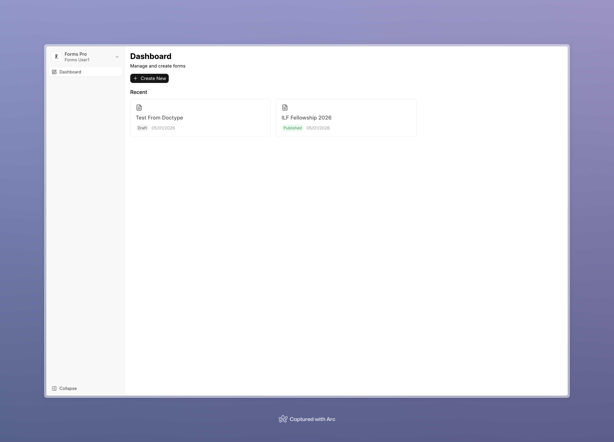
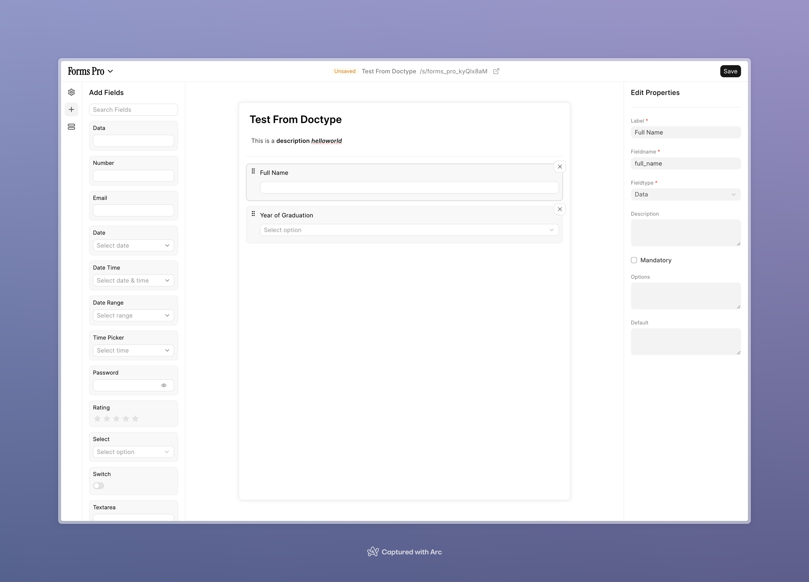
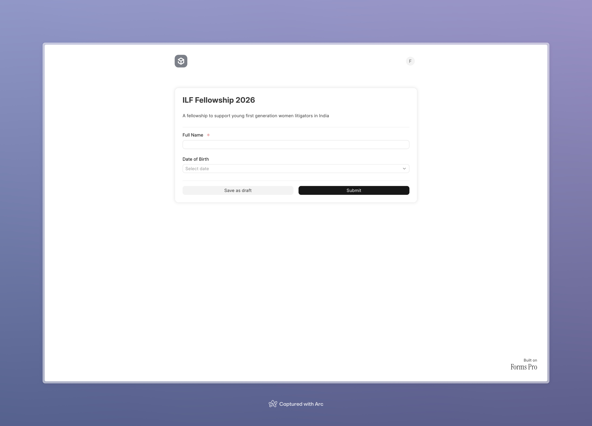

<div align="center">

# Forms Pro

**Web Forms on steroids!**

A powerful, modern form builder built on the Frappe Framework. Forms Pro takes Frappe web forms to the next level with an intuitive drag-and-drop interface, advanced field types, and seamless integration.

[](https://opensource.org/licenses/AGPL-3.0)
[](https://www.python.org/downloads/)
[](https://vuejs.org/)


</div>

---

## ✨ Features

- 🎨 **Modern Drag-and-Drop Builder** - Intuitive visual form builder with real-time preview
- 📝 **Rich Field Types** - Support for Data, Number, Email, Date, DateTime, DateRange, TimePicker, Password, Select, Switch, Textarea, and Text Editor fields
- 🔗 **Doctype Integration** - Link forms to any Frappe DocType for seamless data management
- 👥 **Team Collaboration** - Built-in team support for multi-user form management
- 🔐 **Access Control** - Optional login requirements and permission management
- 💾 **Save Progress** - Allow incomplete submissions with save-and-continue functionality
- 🎯 **Custom Routes** - Publish forms with custom URLs for easy sharing
- 📱 **Responsive Design** - Beautiful, mobile-friendly forms that work everywhere
- ⚡ **Real-time Updates** - Built with Vue 3 and modern web technologies for smooth performance

## 🖼️ Preview

<div align="center">


<br/><br/>

<br/><br/>


</div>

## 🚀 Installation

Forms Pro is a Frappe app and can be installed using the [bench](https://github.com/frappe/bench) CLI.

### Prerequisites

- Frappe Framework installed via bench
- Python 3.10 or higher
- Node.js and npm/yarn (for frontend development)

### Install via Bench

```bash
cd $PATH_TO_YOUR_BENCH
bench get-app https://github.com/buildwithhussain/forms_pro --branch develop
bench install-app forms_pro
```

### Development Setup

For development, you'll need to set up the frontend:

```bash
cd apps/forms_pro/frontend
yarn install
yarn dev  # For development
yarn build  # For production build
```

## 📖 Usage

1. **Create a Form**: Navigate to Forms Pro in your Frappe desk
2. **Add Fields**: Use the drag-and-drop builder to add and arrange form fields
3. **Configure Settings**: Set up form title, description, linked doctype, and other settings
4. **Publish**: Enable "Is Published" and set a custom route
5. **Share**: Share your form URL with users

### Form Builder Features

- **Drag and Drop**: Reorder fields by dragging them in the builder
- **Field Properties**: Customize each field's label, type, validation, and options
- **Live Preview**: See your form as you build it
- **Rich Text Description**: Add formatted descriptions using the text editor

## 🛠️ Tech Stack

- **Backend**: Python 3.10+, Frappe Framework
- **Frontend**: Vue 3, TypeScript, Vite
- **UI Components**: Frappe UI, Tailwind CSS
- **Form Builder**: Vue Draggable
- **Validation**: Zod
- **Icons**: Lucide Vue, Feather Icons

## 🤝 Contributing

We welcome contributions! Forms Pro uses `pre-commit` for code formatting and linting.

### Setup for Contribution

1. **Fork the repository** and clone your fork
2. **Install pre-commit**:

   ```bash
   cd apps/forms_pro
   pre-commit install
   ```

3. **Create a branch** for your changes:

   ```bash
   git checkout -b feature/your-feature-name
   ```

4. **Make your changes** and ensure they pass linting:

   ```bash
   pre-commit run --all-files
   ```

5. **Submit a pull request** with a clear description of your changes

### Code Quality Tools

This project uses the following tools for code quality:

- **ruff** - Python linter and formatter
- **eslint** - JavaScript/TypeScript linter
- **prettier** - Code formatter
- **pyupgrade** - Python syntax upgrades
- **biome** - Fast formatter and linter for frontend

## 🧪 Testing

The project includes automated testing via GitHub Actions:

- **CI**: Installs the app and runs unit tests on every push to `develop` branch
- **Linters**: Runs [Frappe Semgrep Rules](https://github.com/frappe/semgrep-rules) and [pip-audit](https://pypi.org/project/pip-audit/) on every pull request

## 📄 License

This project is licensed under the **AGPL-3.0** License - see the [LICENSE](LICENSE) file for details.

## 👥 Authors

- **Harsh Tandiya** - [harsh@buildwithhussain.com](mailto:harsh@buildwithhussain.com)
- **BWH Studios** - [developers@buildwithhussain.com](mailto:developers@buildwithhussain.com)

## 🙏 Acknowledgments

- Built on the amazing [Frappe Framework](https://github.com/frappe/frappe)
- Inspired by the Frappe community's need for better form building tools

---

<div align="center">

**Made with ❤️ by [BWH Studios](https://github.com/buildwithhussain)**

[Report Bug](https://github.com/buildwithhussain/forms_pro/issues) · [Request Feature](https://github.com/buildwithhussain/forms_pro/issues) · [Documentation](https://github.com/buildwithhussain/forms_pro)

</div>
